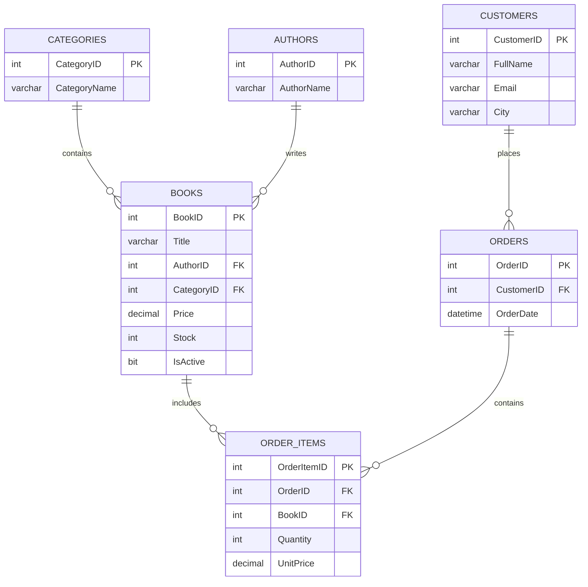

# BookStore SQL Database

## Description

This project is a relational database design and implementation for an online bookstore. It handles books, authors, categories, customers, and order processing. The schema is designed with data integrity in mind, ensuring prices and stock levels cannot be negative, email addresses remain unique, and historical pricing is preserved in order records regardless of future price changes.

